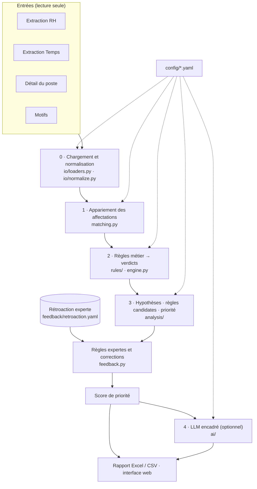

# Architecture

CorroborAI est un pipeline en cinq niveaux. Les trois premiers établissent les
verdicts de façon déterministe ; les deux suivants les expliquent et les
priorisent sans jamais les modifier. Cette séparation est structurelle : elle
est imposée par le modèle de données, pas seulement par convention.

## Niveaux

### 0 · Chargement et normalisation

`io/loaders.py` lit chaque fichier **une seule fois en octets** ; l'empreinte
SHA-256 est calculée sur exactement les octets analysés. Excel et CSV sont
acceptés (séparateur et encodage détectés) ; le CSV « tassé » dans une seule
colonne Excel du détail du poste est déplié. Chaque ligne reçoit `_row`, son
numéro de ligne d'origine, qui sert à toutes les preuves. Aucune valeur n'est
corrigée au chargement.

`io/normalize.py` fournit des fonctions pures par type de champ (`text`,
`text_loose`, `code`, `date`, `bool`, `number`) : une différence de format
(« 2003-12-12T00:00:00.000Z » / date Excel, « Oui » / « true », « 00397 » /
« 397 », « 40 » / « 40.0 », encodage « complète ») n'est pas un écart. Une
valeur non interprétable lève une erreur, transformée en verdict
`INDETERMINE` traçable plutôt que masquée.

### 1 · Appariement des affectations

`matching.py` apparie les lignes par employé, puis par type d'affectation
(principale, temporaire, secondaire). À type égal et plusieurs candidats,
l'affectation optimale maximise la similarité de contenu (emploi, unité,
imputation, site, échelle, date d'entrée, heures) — jamais l'ordre des lignes.
Les restes d'un même employé sont appariés entre types différents au-delà d'un
seuil de similarité ; sinon, l'affectation est déclarée absente de la cible ou
de la source (anomalie `R-MATCH`).

### 2 · Règles métier

`rules/implementations.py` implémente onze types de règles déclarés dans
`config/rules.yaml` (report direct, concaténation, courriel, transcodage du
type d'employé, situation d'emploi, dates d'affectation…). Chaque règle
calcule une **valeur attendue** ; la décision est uniforme
(`rules/base.py`) :

| Valeur cible | Verdict |
|---|---|
| égale à la source après normalisation | `CONFORME` |
| différente de la source, égale à la valeur attendue | `JUSTIFIE` |
| différente de la valeur attendue | `ANOMALIE` |
| valeur attendue incalculable, ou valeur illisible | `INDETERMINE` |

Les ambiguïtés du texte des règles sont tranchées par des **interprétations**
nommées. `engine.py` réévalue chaque champ sous chaque interprétation
alternative : si le verdict en dépend, la confiance passe à `MOYENNE` et le
verdict alternatif est tracé ; le rapport publie le taux d'accord de chaque
interprétation avec la cible.

### 3 · Analyse des écarts

`analysis/hypotheses.py` teste, pour chaque anomalie ou indéterminé, un
catalogue fermé d'hypothèses génériques (`config/hypotheses.yaml`). Les
hypothèses de niveau champ s'appuient sur toute la population : une source
alternative n'est retenue que si elle concorde avec la cible sur au moins 90 %
des enregistrements — elle devient alors une **règle candidate**.
`analysis/scoring.py` calcule une priorité dont chaque terme est publié.

### Rétroaction experte

`feedback.py` applique, après l'analyse et avant la priorité, les règles
expertes (mini-langage fermé, ANOMALIE → JUSTIFIE uniquement) puis les
corrections de verdict (la plus spécifique l'emporte). Les verdicts modifiés
portent la source de décision `EXPERT`, la règle ou la correction appliquée,
et le verdict initial.

### 4 · LLM encadré

`ai/` rédige des synthèses, propose une piste pour les anomalies inexpliquées
et traduit une consigne experte en règle. Voir [Utilisation de l'IA](IA.md).

## Modèle de données

Tout le pipeline produit ou consomme des `Finding` (`models.py`) :

| Attribut | Rôle |
|---|---|
| `person_id`, `assignment_key`, `target_field` | identité de l'écart (`finding_id`) |
| `source_raw`, `expected`, `target_raw`, `target_norm` | valeurs comparées |
| `verdict`, `decision_source`, `rule_id`, `rule_ref`, `rule_params` | décision et règle (référence `Mapping.xlsx`, interprétation, verdicts alternatifs) |
| `justification`, `subcategory`, `confidence` | explication déterministe |
| `evidence` | preuves : table et ligne d'origine de chaque donnée utilisée |
| `hypotheses`, `probable_cause` | analyse des écarts |
| `criticality`, `priority`, `priority_breakdown` | priorisation |
| `explanation`, `explanation_source` | texte rédigé (`LLM` ou `GABARIT`) |

Invariants vérifiés à la construction :

- un verdict ne peut provenir que d'une règle (`REGLE_DETERMINISTE`) ou de
  l'expert (`EXPERT`) — **jamais de l'IA** ;
- un verdict `JUSTIFIE` référence une règle ;
- une justification est obligatoire ;
- une hypothèse ne peut citer que des preuves présentes dans l'écart.

## Garanties

| Garantie | Mécanisme | Vérification |
|---|---|---|
| Fichiers sources jamais modifiés | lecture en octets uniquement ; empreintes recalculées après traitement | feuille « Intégrité » ; tests d'altération sur copies |
| Verdicts déterministes et reproductibles | aucune source aléatoire ; appariement indépendant de l'ordre | tests de reproductibilité et de mélange des lignes |
| L'IA ne modifie aucun verdict | invariant du modèle ; schéma de sortie sans champ de verdict | test avec un modèle malveillant simulé ; verdicts identiques avec et sans analyse |
| Chaque verdict est explicable | justification, règle, référence, preuves (table:ligne) | test : chaque preuve pointe vers une ligne existante |
| Aucune donnée personnelle vers un service externe | pseudonymisation ; politique de flux fermée par défaut ; balayage anti-fuite | tests sur tous les dossiers réellement produits |
| Configuration cohérente avec le mapping | validation de `rules.yaml` contre les données et `Mapping.xlsx` | tests par mutation de la configuration |

## Points d'extension

| Besoin | Où intervenir |
|---|---|
| Ajouter ou modifier un champ corroboré | `config/rules.yaml` (champ, règle, criticité, référence) ; régénérer `docs/REGLES.md` |
| Nouvelle interprétation d'une règle ambiguë | section `interpretations` de `rules.yaml` ; la règle lit `ctx.choice(...)` |
| Nouveau type de règle | `rules/implementations.py` (fonction + `REGISTRY`) et `KNOWN_RULE_TYPES` |
| Nouvelle hypothèse | `analysis/hypotheses.py`, `config/hypotheses.yaml` (description, précédence), `config/scoring.yaml` (modificateur) |
| Nouveau fournisseur LLM compatible OpenAI | `config/llm.yaml` uniquement |
| Nouvelle tâche LLM | schéma dans `ai/schemas.py`, dossier et gabarit, appel via `Harness.run` |
| Nouvelle opération de règle experte | `OPERATIONS`, `validate_rule` et `rule_matches` dans `feedback.py` |

Chaque fichier de configuration est validé au chargement ; les tests par
mutation garantissent qu'une erreur de configuration est détectée.
